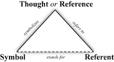
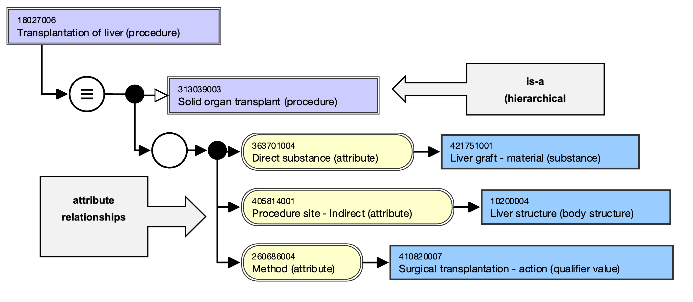

# An introduction to terminological principles

Understanding of terminology and specialized knowledge representation is a key factor for successful scientific translation. SNOMED CT translations must therefore be based on **terminological principles** developed by Terminology Science (TS). This discipline is a branch of linguistics that deals with specialized vocabulary. It focuses on the study of lexical units (words) with a specialized meaning called **terms**. Terms are analyzed from the point of view of their origin, formal structure, meaning and their functional characteristics. Since terms are used to denote **concepts** , TS also deals with the formation and development of concepts and relationships between concepts and their classification in **concept systems**. Furthermore, TS formulates the principles of concept **definition** and the evaluation of existing definitions. In view of the fact that the properties and functioning of terms depend to a large extent on their lexical environment, it is common practice to consider not individual terms but the entire terminology used in a particular field of knowledge (also called subject area) as the main subject of TS.

In the following, we will give a summary description of concepts and terms, concept systems, and definitions. Please see the international terminology standard ISO 1087-1:2000 for a systemic description of these notions.

## Concepts and terms

The **semiotic triangle** (Figure 1) introduced by Ogden and Richards (1923/1989) is of central importance in terminology work. This triangle is a model of how symbols are related to the objects they represent. It consists of 3 elements: concept (“**Thought or Reference** ”), designation (“**Symbol** ”) and object (“**Referent** ”). A **concept** is the mental image of concrete or abstract objects in reality and consists of characteristics based on properties observed in an object or in its relationship to other objects. Concepts are represented by a **designation** (symbol) such as words (in general language), **terms** (in specialized language) or other perceivable notations (e.g. graphics, numbers, etc.). In SNOMED CT the concepts are represented by so-called **Descriptions**(see Section 3.4).

<figure><figcaption>
<strong>Figure 1</strong> – The semiotic triangle (Odgen and Richards 1923/1989)
</figcaption></figure>

The dotted line between the referent (object) and the symbol (description) indicates that there is no direct connection between the two, as the object must be conceptualised before it can be rendered. There is also no one-to-one (i.e. one term refers to one concept) but a many-to-one relation between concept and term (different terms refer to one and the same concept). Examples are the English terms “typhoid fever” and “infection by Salmonella Typhi” for the concept |typhoid fever|. This is called **synonymy** , which is a frequent phenomenon in clinical terminology. Conversely, one term can refer to different concepts (i.e. one and the same term has different meanings), which is called **polysemy**. For example, the term “drug” refers, depending on the context, to the following concepts: (1) |substance used for diagnostic/treatment/ prevention purposes|; (2) |chemical substance used as narcotic or hallucinogen|; (3) |substance used in dyeing or chemical operations (obsolete)|.

## Concept systems

The main goal of terminology work is to clarify and standardize concepts and terms to facilitate unambiguous communication in natural (human) language. Concepts are related to other concepts (conceptual relations) and form networks or **concept systems** , which are extremely useful in many contexts: they provide an overview of a subject area and make it possible to delimit and define concepts, to form new descriptions, to evaluate existing and competing descriptions, and to structure systematic representations of a given domain. Since concept systems are important tools for analysing and translating concepts, they play a crucial role in terminology work.

According to ISO 1087-1:2000 **conceptual relationships** can be divided into hierarchical relationships (generic is-a relationships), partitive relationships (whole-part relationships) and associative (non-hierarchical) relationships. In SNOMED CT generic and attribute relationships are used to define concepts in a formal language that is understandable to both humans and computers (Figure 2).

<figure><figcaption>
<strong>Figure 2</strong> – Hierarchical and attribute relationships in SNOMED CT; example with the stated view of concept 18027006 |Transplantation of liver (procedure)| (International Edition 2021-07-31)
</figcaption></figure>

## Definitions

In terminology work, the definition of a concept is extremely important. A definition describes the characteristics of a concept to delimit it from neighboring concepts. Definitions are therefore essential for the clear assignment of terms to the underlying concepts. There are different types of definitions (analytical, encyclopaedical). Definitions can be written in natural language or in a (semi-)formal language.

Definitions play a key role in the translation of SNOMED CT (see Section 4). Descriptions cannot be translated literally but their meaning (i.e. their conceptual content) must first be clarified. This is the only way to ensure that the meaning of the description is correctly reflected in the target language. In SNOMED CT concepts are defined in different ways (see Section 3.2).
