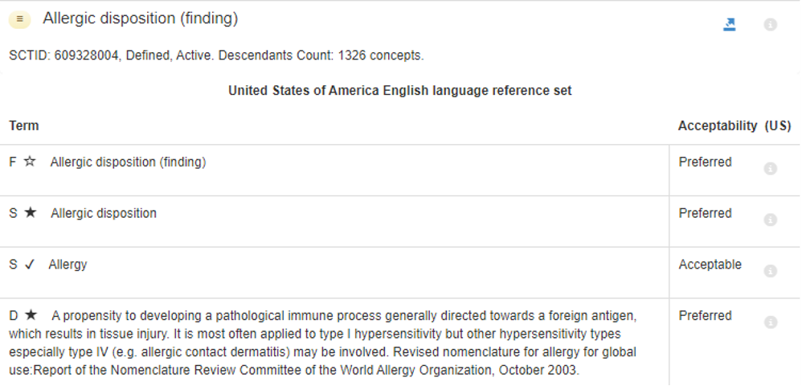
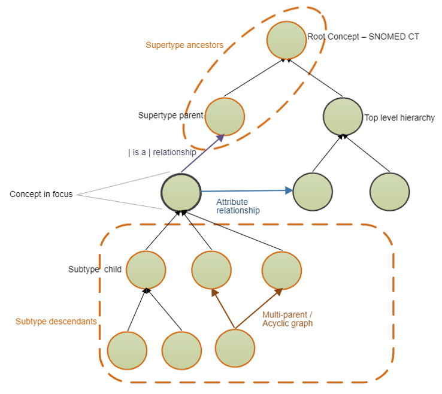

# SNOMED CT as a health terminology

The following sections outline the main features of the structure of SNOMED CT and particular aspects of interest to translators. More detailed information on the structure of SNOMED CT can be found in the [SNOMED CT Guides](https://docs.snomed.org).

## Concept systems and ontologies

Conceptual relationships can be coded in formal structures or so-called **ontologies**. The construction of ontologies is based on conceptual networks derived from **expert knowledge**. The aim is to represent domain-specific knowledge (i.e. the conceptualization of a particular domain) in a formal, computer-readable and consensus-based way in accordance with criteria agreed upon by a community of experts. The elements of knowledge are defined according to a set of properties and linked via explicit relationships of different kinds (both hierarchical and non-hierarchical such as partitive, cause-effect, etc.). Since the concepts and relations are represented formally, the information can be processed electronically, allowing different kinds of operations such as data retrieval and standardized data exchange.

SNOMED CT is a **terminological ontology** that combines the terminological approach of concept system creation described in [#concept-systems-and-ontologies](./#concept-systems-and-ontologies "mention") with knowledge-based ontology design. It is developed by domain experts for domain experts as knowledge resource for information exchange for use in various applications. The system uses a relationship-based representation of concepts (Concept 1 Concept 2) by means of the formal ontology language Description Logic (e.g. _Common Cold_ _Virus_).

## SNOMED CT definitions

In SNOMED CT concepts are defined in three different ways.

(1) The meaning of a SNOMED CT concept is expressed in a human-readable form by its Fully Specified Name (FSN). This is a Description that represents the meaning of a concept in a way that is unambiguous and independent of the context in which it is used (for a detailed description, see Section [#id-3.4-description-types](./#id-3.4-description-types "mention")).

(2) Each concept also has a formal concept definition that provides a computer-processable representation of the meaning of the concept. Conceptual relationships are generated in two ways, either by human users proposing a new concept or automatically by the SNOMED CT OWL description logic classifier. The manually created representation is referred to as “stated view” (Figure 3).


<figure><figcaption><p>Figure 3: Diagrammatic representation of the relationships as “stated view” of the concept 195216008 |Left sided cerebral hemisphere cerebrovascular accident (disorder)| (International Edition 2021-07-31)</p></figcaption></figure>

The automatically generated representation is referred to as “inferred view” (Figure 4).

<figure><figcaption><p>Figure 4. Diagrammatic representation of the relationships as “inferred view” of the concept 195216008 |Left sided cerebral hemisphere cerebrovascular accident (disorder)| (International Edition 2021-07-31)</p></figcaption></figure>

For translators it is of outmost importance to look also at the formal definition of the concept as SNOMED CT translations should be concept-based. The formal definition can help to understand the meaning and to increase translation consistency.

The formal rules of description logic can also be used to support meaning-based retrieval from records containing SNOMED CT expressions or concepts (more information, please refer to /).

Textual definitions that describe the meaning of a concept in natural language (see [#id-3.4-description-types](./#id-3.4-description-types "mention") and Figure 5). Only a minority of concepts have a textual definition.

<figure><figcaption><p><strong>Figure 5</strong> – Illustration of the three SNOMED CT Description types in the US English language refset of concept 609328004 |Allergic disposition (finding)| (International Edition 2021-07-31) F - Fully Specified Name; S - Synonym; D - Definition</p></figcaption></figure>

## The hierarchical and multi-axial structure of SNOMED CT

SNOMED CT contains more than 350,000 concepts from **clinical and non-clinical** concept fields or **domains** (e.g. Body Structure, Clinical Finding, Procedure, Substance, Event, Environment or geographical location, Physical object, etc.). These concepts are arranged in 19 top-level **hierarchies** according to the domain to which they belong (Figure 6).

<figure><figcaption><p><strong>Figure 6</strong> – The 19 SNOMED CT top level hierarchies as displayed in the SNOMED International browser () taxonomy view</p></figcaption></figure>

At the top of the SNOMED CT hierarchy is the **root concept** (|SNOMED CT concept|), which represents the terminology itself. All other concepts are derived from this root concept through at least one sequence of is-a relationship. This means that the root concept is a **supertype** of all other concepts and all other concepts are subtypes of the root concept. The direct subtypes of the root concept are called “Top Level Concepts”; each of these Top Level Concepts, together with its many subtype descendants, forms a branch of the hierarchy that contains similar types of concepts and also names the branches of the subtype hierarchy. For example, the intermediate concept 788951001 |Hemorrhage of digestive system (disorder)|, which has 17 children, is itself a type of |Disease| which is a type of |Clinical finding|. The further down the hierarchy, the more granular, or in other words more precise, a concept is. This principle is referred to as **granularity** (Figure 7).

<figure><figcaption><p><strong>Figure 7</strong> – Granularity (SNOMED International browser () summary view, International Edition 2021-07-31)</p></figcaption></figure>

The top rectangle in Figure 7 shows the hierarchy view up to the root concept for each parent |Bleeding (finding)| and |Disorder of digestive system (disorder)| of the concept 788951001 |Hemorrhage of digestive system (disorder)|. The lower rectangle shows some of the 17 child concepts, while the middle rectangle shows the concept Descriptions. The rectangle to the right shows the concept’s relationships.

As many clinical concepts are multidimensional by nature, concepts can have more than one parent. This creates a polyhierarchical structure, which increases the amount of information provided. As the formal representation language of SNOMED CT uses both hierarchical and attributive relationships, the multidimensional character of concepts can be expressed accordingly. Figure 8 shows the polyhierarchical structure of SNOMED CT concepts.

<figure><figcaption><p><strong>Figure 8</strong> – Polyhierarchical structure of concepts (as shown in SNOMED International [Starter Guide](https://confluence.ihtsdotools.org/display/DOCSTART/SNOMED+CT+Starter+Guide))</p></figcaption></figure>

Figure 9 shows the full polyhierarchical view of the concept 788951001|Hemorrhage of digestive system (disorder)|.

<figure><figcaption><p><strong>Figure 9</strong> – Full polyhierarchical view of concept 788951001 |Hemorrhage of digestive system (disorder)| (International Edition 2021-07-31) using Ontoserver Shrimp browser ()</p></figcaption></figure>

## Description types

Each concept is represented at least by two types of Descriptions: one **Fully Specified Name** **(FSN)** and **Synonyms (SYN),** one of which is marked as the**Preferred Term (PT)**(Figure 10). The presence of a Description of type definition is optional.

<figure><figcaption><p><strong>Figure 10</strong> – SNOMED CT descriptions</p></figcaption></figure>

The FSN is “a description that represents the meaning of a concept in a way that is unambiguous and independent of the context in which it is used” (SNOMED International 2020). Therefore, an FSN can also be considered as a kind of definition or explanation as it describes the content of the concept as explicit as possible (see Section 3.2). If a synonym, the logical definition or the logical definition or the text definition conflicts with the FSN, the FSN is the gold standard or so-called “Source of Truth”. The FSN should be able to stand alone as complete, unambiguous & comprehensible.

A FSN is composed of a term and a “semantic tag” between parenthesis at its end (e.g. |Myocardial biopsy (procedure)|). The tag indicates the hierarchy to which the concept belongs (e.g. procedure, disorder, organism, etc.). Each concept has a FSN, which is unique in SNOMED CT in a given language, even in cases of FSNs with identical terms that refer to concepts belonging to different categories. For example, |Hematoma (morphologic abnormality)| is the FSN that represents what the pathologist sees under the microscope, whereas |Hematoma (disorder)| is the FSN that indicates the clinical diagnosis of a hematoma. This FSN is not intended for display in clinical records, but is used to clarify the hierarchical relationships of concepts.

A FSN is only used when the user needs to be able to distinguish between hierarchies (which is not necessary in most use cases for healthcare professionals as they will use a reference set or a single hierarchy as value set for their EHR fields).

Every concept must have at least one active fully specified name in US English. This is the point of reference for the meaning of concepts in the SNOMED CT International Edition. Language reference sets must include a single preferred fully specified name for each concept in a language context. For concepts that are part of an extension, the preferred fully specified name in a language specified by that extension may be the point of reference.

A _synonym_ is “a word or phrase that expresses the meaning of a SNOMED CT concept in a specific language” (SNOMED International 2020). Each concept may have multiple synonyms, one of which is marked as “preferred” to support consistent recording of the underlying concept. The Preferred Term (PT) is “the term deemed to be the most clinically appropriate way of expressing a concept in the specified language context” (SNOMED International 2020). It is the recommended description to display a concept. The PT should be unique within its own hierarchy and should not contain homonyms. The other synonyms are marked as ‘Acceptable’. Synonyms are useful for retrieval purposes.

Each national edition of SNOMED CT must include at least one Fully Specified Name and one Preferred Term to represent each concept. Each Description has a unique numeric Description Identifier in addition to a Description Type.

Further information on concept Descriptions can be found in the [SNOMED CT Starter Guide](https://app.gitbook.com/o/h8Z6qGxuQrzM9vbx5bPT/s/UmSUeu96fIQZWDm7RISx/).

A textual description or definition (see Section 2.3) is also a Description Type, but it is not mandatory. It is provided for a limited number of concepts, where there is a requirement for additional detail, such as specifying the alignment of a SNOMED CT concept with a specific clinical definition of a condition. For example, the concept 22649008 |Photodermatitis (disorder)| i[s defined as “An abnormal inflammatory skin condition resulting from exposure to ultraviolet light, most commonly sunlight. May result from phototoxic or photoallergic reactions or both](http://snomed.info/id/11530004)” (Table 1).

Text definitions can, but do not have to be translated. SNOMED International intends to introduce more Description types in the future and make them configurable. For example, a Description type could be configured for search terms that include Descriptions (i.e. terms) that are inappropriate for display and data exchange but useful for clinicians to quickly retrieve them at the data collection interface. Examples are Descriptions containing spelling errors, Descriptions that are not correct but commonly used in clinical practice (e.g. “uterine fibroma" for “uterine leiomyoma”) or polysemous acronyms (e.g. “IRA” which stands both for “acute renal insufficiency” and “acute respiratory insufficiency”.

| Description type     | Description                                                                                                                                                                  |
| -------------------- | ---------------------------------------------------------------------------------------------------------------------------------------------------------------------------- |
| Fully Specified Name | Photodermatitis (disorder)                                                                                                                                                   |
| Synonym (Preferred)  | Photodermatitis                                                                                                                                                              |
| Synonym (Acceptable) | Photosensitivity dermatitis                                                                                                                                                  |
| Text definition      | An abnormal inflammatory skin condition resulting from exposure to ultraviolet light, most commonly sunlight. May result from phototoxic or photoallergic reactions or both. |

**Table 1** – SNOMED CT description types for the concept 22649008 |photodermatitis (disease)| in the Great Britain English language reference set

For translation purposes the three types of Definitions can be useful (see Section 4). Professional translators without medical expertise will have greater difficulty understanding all SNOMED CT by their formal relationships. Therefore, natural language definitions and textual sources that provide information on the contextual use of a concept are important additional tools.

## SNOMED CT logical definitions, attributes and relationships

In the SNOMED CT ontology, each concept is logically defined through its relationships to other concepts. For the definition of a concept, attribute-value pairs are used in addition to the hierarchical “is a” relationships. An attribute represents a characteristic of the meaning of a concept to which a value is assigned.

The attributes that can be applied depend on the concept model. The concept model defines which attribute value-pairs can be applied to which (sub)hierarchy of concepts and how those attribute-value pairs need to be grouped together to ensure correct unambiguous understanding of the concept definition (see the Editorial Guide for a detailed description of concept models). For example, a procedure may have a method, and a disorder may have an etiology, but a procedure cannot have an etiology, and disorder cannot have a method. Defining characteristics represent the values of a range of relevant attributes. Depending on the nature of the concept, there are more than 100 approved attributes to be used in the concept model. The permitted range of values for an attribute depends on the rules specified in the concept model.

All SNOMED CT concepts are linked at least by one is-a relationship to the immediate superordinate(s) concept(s) and by zero to many attributive relationships. Both types of relationships together form the (formal) definition of a concept. Relationships are not limited to concepts and can also refer to numerical values in products.

There are two types of defined concepts: fully defined and primitive concepts.

A fully (or sufficiently) defined concept has at least one sufficient definition that distinguishes it from any concepts or expressions that are neither equivalent to, nor subtypes of, the defined concept.

For example, the concept 74400008 |Appendicitis (disorder)| is sufficiently defined by the following definition because any concept for which these defining relationships are true, is either the disorder appendicitis or a subtype of appendicitis.

```
74400008 |Appendicitis (disorder)| ===     
    64572001 |Disease (disorder)| : 
        {
            116676008 |associated morphology| = 23583003 |inflammation| ,
            363698007 |finding site| = 66754008 |appendix structure|
        }
```

A primitive concept has a concept definition that is not sufficient to computably distinguish it from other concepts.

For example, the concept 5596004 |atypical appendicitis (disorder)| is primitive because the following definition is not sufficient to distinguish atypical appendicitis from its parent concept <<<74400008 |appendicitis (disorder) nor it sibling:

See below the definition |Atypical appendicitis|, its parent |Appendicitis| and its sibling |Catarrhal appendicitis|. These three concepts share the same SNOMED CT logical definition in the stated view. The clinical information not represented in the SNOMED CT logical definition of |Atypical appendicitis| and |Catarrhal appendicitis| is _emphasized_ , making them primitive concepts.

```
74400008 |Appendicitis (disorder)|

<<< 64572001 |Disease (disorder)| : 
    {
    116676008 |associated morphology| = 23583003 |inflammation|,
    363698007 |finding site| = 66754008 |appendix structure|
    5596004 |Atypical appendicitis (disorder)| 
    }

<<< 64572001 |Disease (disorder)| : 
    {
    116676008 |associated morphology| = 23583003 |inflammation|,
    363698007 |finding site| = 66754008 |appendix structure|
    8744003 |Catarrhal appendicitis (disorder)|
    }

<<< 64572001 |Disease (disorder)| : 
{
    116676008 |associated morphology| = 23583003 |inflammation|,
    363698007 |finding site| = 66754008 |appendix structure|
    }
```


## SNOMED International Editorial Guide and Confluence Templates

SNOMED International has numerous resources to promote the understanding and use of SNOMED CT. These documents are available in the Document Library, which is a collection of SNOMED CT documents, including introductory material, practical guides, technical specifications and reference material.

The Editorial Guide provides detailed information on the rules under which the international content of SNOMED CT is authored. It describes the scope, hierarchies, authoring principles, style guidelines and concept model rules of SNOMED CT for each domain ([http://snomed.org/eg](http://snomed.org/eg)).

For example, when translating the Body structure hierarchy, translators are presented with a large number of concepts represented by terms containing the words “structure”, “part of”, “entire” and “all”, which should be interpreted with caution (for more details see Appendix B of the Editorial Guide).
