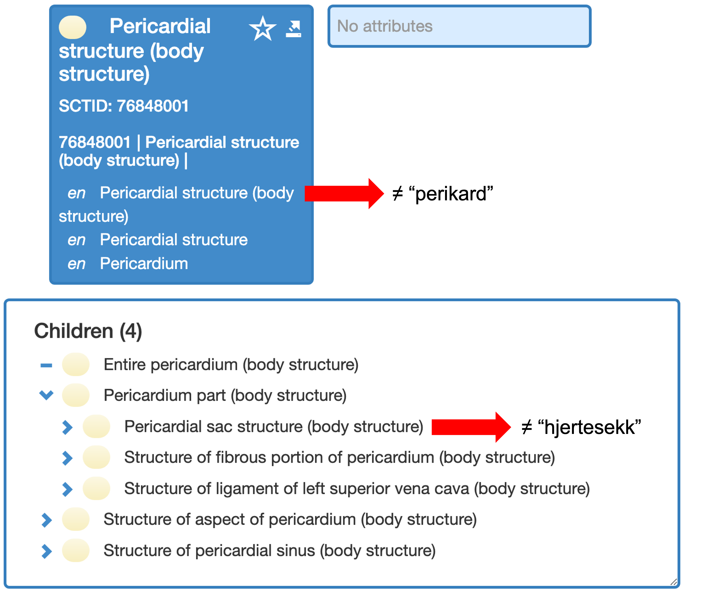
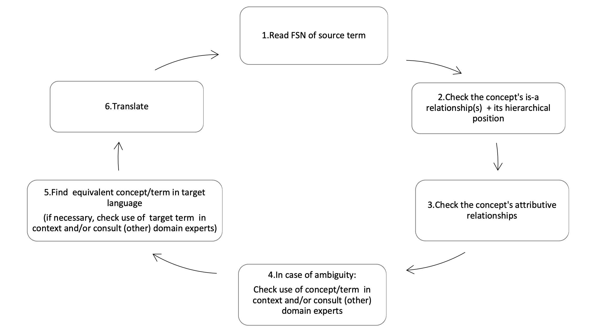

# Translating SNOMED CT

SNOMED CT translations are required for the implementation of the terminology in non-English speaking countries. The most important goal when translating is to ensure semantic equivalence between the source (International Release) and target language (National Releases). Therefore the principle of **concept-based translation** must be applied: Translations should never be literal (i.e. should **not** start from the term to be translated), but should always be based on the Fully Specified Name (FSN), which describes the meaning of the term in natural language. The next step is to look at the position of the concept in the ontology (i.e. the formal concept model) to investigate the formal definition of the concept.

An example is the translation of |Pericardium| to Norwegian (Figure 11). Medical dictionaries and encyclopedias list “perikard” and “hjertesekk” (literally “heart sac”) as synonyms and valid translations. For most practical uses, this would be true. However, the translator should keep in mind the fine granularity of the SNOMED CT concept hierarchy, in which the |Pericardium| is a superordinate concept that includes several subordinate concepts, including the |Pericardial sac|. Considering the concepts in the hierarchy, the proper translation of |Pericardium| is “perikard”, while “hjertesekk” is equivalent to |Pericardial sac|.

<figure><figcaption>
<strong>Figure 11</strong> – Example of concept-based vs literal translation approach
</figcaption></figure>

As the ontology may contain errors, it is important that translators are aware of possible inconsistent or erroneous formal relationships and report modelling that contradicts the FSN.

SNOMED CT is a comprehensive terminology designed to meet the needs of a broad group of health care professionals in a range of settings. Translations should comply with the principles on which SNOMED CT was originally based: **understandability** , **reproducibility** and **usefulness** (URU). Therefore, the translation should adhere to the principles elaborated by Terminology Science for useable terms: terms should be transparent and reflect the essential characteristics of the designated concept; terms should satisfy the requirements of the users’ needs, i.e. they should be in accordance with clinical usage and they must be equally well understood by the different health professionals who use them. For each target language national linguistic guidelines, including syntactic, morphological and orthographic rules, are developed to support this approach.

## Basic approach

Interdisciplinary cooperation in terminology work is crucial (Infoterm 2005). The ideal approach to the translation process should therefore be close collaboration between healthcare professionals, terminologists, linguists, and professional translators. This ensures conceptual equivalence between source and target terms and linguistic correctness. In contrast, literal term-based translations based on purely linguistic morphologic-syntactic analysis may provide terms that appear correct at first glance, but which do not correctly reflect the true meaning of the underlying concept. At the same time, the observance of linguistic, systematic and orthographic principles is absolutely necessary to ensure the consistency and practicability of the terminology as well as the predictability of the translations, which improves findability.

In practice, this means that a number of basic principles must be followed with regard to the morpho-syntactic structure of terms to ensure consistency, but in cases where there are serious conflicts with everyday clinical language, clinical use should have priority.

In practice, this means that a number of basic principles must be followed with regard to the morpho-syntactic structure of terms to ensure consistency, but in cases where there are serious conflicts with everyday clinical language, clinical use should have priority.

The following sections address the main issues that translators may face. The goal of any translation is to achieve consistent, usable, and clinically acceptable translation equivalents in the target language.

### The principle of concept based translation

The translation of complex terms requires a relatively high level of domain knowledge to ensure that each translation (term or phrase) is an accurate representation of the original concept. Therefore, the translation team must carefully check that the meaning of each source concept is clearly understood, including the hierarchical position of the concept and its relationship to other concepts. In Dutch, for example, the literal translation of the English term “arthrosis” without prior analysis of its meaning (“disorder of one or more joints”) generates the incorrect term “arthrosis”( which is the Dutch term for |Osteoarthritis|) instead of the correct concept-based translation "arthropathie".

It is recommended to follow the translation workflow steps illustrated in Figure 12:

<figure><figcaption>
<strong>Figure 12</strong> – Recommended translation workflow steps
</figcaption></figure>

## General linguistic principles

The following paragraphs deal with general aspects of translation that are relevant for all languages.

For each target language, national linguistic guidelines, including syntactic, morphological and orthographic rules, must be provided to describe the specific rules of the target language.

### Language for Specific Purposes

Since the target group of the national edition of SNOMED CT are professionals, high quality language for specific purposes terms should prevail. It is recommended to establish some preliminary general principles for the choice of lexical variants before starting the translation work.

In Danish and German, for example, it is common to use pure Latin or Greek in the field of anatomy, while diagnostic terms or terms describing procedures are often **hybrids** or mixed forms (so called**neoclassical compounds** such as _gastroenteritis_ and _mammography_), or, in some cases, also general language terms.

Colloquial expressions (medical slang words such as _blue pipes_ for veins or _cabbage_ for a _coronary artery bypass graft_ or CABG) should be avoided; if needed, they can be added as synonyms.

Recommendations or guidelines issued by a national language council, authority or body should generally be followed. However, it may be necessary to formulate specific morphological and spelling rules that apply to the terminology of the target language. Specific practices related to the construction of medical terms published in national medical journals should also be taken into account.

### Ambiguities in the source language

As mentioned in the previous sections, all translations should start with a thorough analysis of the conceptual meaning of the FSN and the concept's formal definition.

It is possible that the conceptual meaning is not correctly reflected by the formal definition in the International Edition. In this case, it is recommended that the NRC reports the error to SNOMED International via the Content Request Service (CRS) ([http://snomed.org/crs](http://snomed.org/crs)). Licensed organisations from non-member countries can report directly through CRS. Issues can also be raised for discussion in the JIRA SNOMED CT Translation Feedback Group prior to submitting a CRS request to see how the concept's meaning has been interpreted in other countries. The correct translation can then be produced after a response is received.

### Selection of the right term

The term (i.e. a word, a group of words or compound, or an expression) is the essential component of communication in a specialised subject field. The primary meaning in a language for specific purposes is therefore conveyed in its specialised vocabulary, which should consist of terms that meet the following requirements:

* **Unambiguity** : the term should be understood in the same way by any professional that uses it.
* **Linguistic accuracy** : a term should conform to the language-specific morphological, syntactic, orthographical and phonotactic conventions.
* **Transparency/motivation** : a term should be systematic and self-explanatory, i.e. it should reflect the characteristics of the underlying concept.
* **International recognizability** : terms based on Latin and Greek word elements may be preferred; e.g. universal scientific terms such as “hepatocystis”, “nephritis”, “appendectomy”, “hepatitis”, etc.).
* **Psychological acceptability** : term usability should be taken into account whenever possible (in accordance with the rules of standard language, and not slang).
* **Systematicity and consistency** : semantically similar concepts should be expressed by terms with similar morphological and syntactical structures. It may be interesting to consider the use of translation templates to enhance consistency of translation across similar concepts (see Section 4.3).
* **Conciseness** : a term should be concise and in keeping with the principle of linguistic One should be aware that descriptions of the type FSN and Synonym are technically limited to 255 characters (definitions are limited to 4096 characters).

These general requirements apply to all specialized knowledge fields, including medicine. When translating the clinical terminology SNOMED CT the equivalents in the target language should be carefully selected, especially with regard to the Fully Specified Names (FSNs) and the Preferred Terms (PTs) intended for clinical use. The terminological rules for well-formed terms are less strict with regard to Acceptable Synonyms that may reflect clinical jargon (e.g. the language use of clinical care providers, specialists, nurses, physiotherapists, and others) and support search queries (e.g. “heart attack” as synonym for “myocardial infarction”).

However, it is important that only full (and not near) synonyms are made available. For instance, it is not helpful for understanding/translating a concept if the PT of one concept is the synonym of another (within the same hierarchy). There should be a balance between expressivity on the one hand (through sufficient synonym coverage) and accuracy on the other.

In terminological practice, it is not possible to meet all requirements simultaneously in any language. Psychological acceptance, in particular, often hampers compliance with some of the principles. For example, commonly used eponyms such as “Apgar Score” or “Down's Syndrome” contradict the search for transparency and also challenge the principles of international recognition. Also the simultaneous use of different term types for the same concept (e.g. terms consisting of noun + noun vs. noun + prepositional phrase vs. noun + adjective combinations) challenge systematicity and consistency (e.g. “incision of brain” vs “intracerebral incision”).

The creation of language-specific rules for the translation of SNOMED CT should therefore be carried out with the greatest possible thoroughness and care and should take into account not only linguistic and terminological aspects but also psychological ones. The needs and expectations of the users remain the primary concern and clinical acceptance of the terminology is of crucial importance.

The national translation guidelines should be based on the general editorial framework of SNOMED CT and, where necessary, be adapted to the needs of the respective national language.

### Translation of the Fully Specified Name

FSNs may or may not be translated: there are both arguments for and against the FSN translation.

Arguments in favor are:

* Translating the FSN helps identifying duplicate concepts
* Translating the FSN provides local terminologists with a description that is unique, unambiguous and independent from context
* The stringent wording of the translated FSN allows more options for the PT (e.g. use of acronyms)

Arguments against are:

* The FSN is the source of truth
* The FSN should be immutable, which does not allow for inaccurate translation
* The editor may not allow multiple FSNs for countries with multiple languages
* The translation of the FSN requires more resources

The decision whether or not to translate the FSN depends on the individual NRCs.

### Concept equivalence

Concept equivalence means that a word or phrase means exactly the same thing in the source and target languages. Determining equivalence requires a deep understanding of the source language and culture. A literal (word-for-word) translation is in many cases wrong, because you first need to understand the meaning behind the words.

#### Cultural variations

Cultural differences must always be taken into account when translating. The question of conceptual equivalence or the lack of such equivalence must therefore be given special attention.

Due to its historical development, part of the source language terminology of SNOMED CT is based on British or American administrative structures or clinical practices that are not necessarily internationally valid. This is currently the case with regard to subhierarchies such as Social context, Regimen/therapy, Environment or Geographical location, Substance and Pharmaceutical/Biological product hierarchies. In the case of drug and vaccine concepts, for example, the pharmaceutical form of drugs may vary from country to country. At the same time, local regulations may dictate which drugs should be included in the national edition. The pharmaceutical/biological products subhierarchy is therefore a typical example of a hierarchy that requires a complete overhaul involving local pharmacologists to adapt to local needs, and preferably to define a national extension.

Although it is theoretically possible to find national equivalents (e.g. paraphrases) that make such culture-dependent (i.e. not locally anchored) concepts understandable, the local applicability of such culture-dependent concepts is questionable. One example is the US concept of |veteran hospital|, a special kind of medical facility where former US soldiers receive medical care. It may therefore be necessary to develop new subhierarchies within a national edition in order to do justice to culture-specific concepts. In summary, it is advisable to identify the subhierarchies with concepts that are not nationally valid before the national translation process begins. The decision on how to deal with these concepts should then be made locally. Not translating these concepts is a viable option. If it is felt that these concepts should be local to the UK or US, SNOMED International can be asked to move them to these extensions.

#### False friends

False friends are word pairs from two languages that are similar in writing (orthographic) or pronunciation (phonetic) but that differ significantly in meaning. The words can either be related in origin but developed differently or have a purely coincidental similarity. False friends can lead to an unrecognized false translation when translated literally. Examples are the English term “ventilator” (meaning a device used to maintain an airflow into and out of the lungs of a patient who is unable to breathe) and the German term “Ventilator” (meaning fan; the correct German equivalent in the clinical context for “ventilator” is “Beatmungsgerät”).

Similar problems arise when a term in one language covers a broader concept than in the other language. An example are **holonyms** , i.e. terms that denote a whole whose part is designated by another term (e.g. “hand" in relation to "finger”). Conversely, **meronyms** denote a component or a part of something (e.g. “finger” in relation to “hand”). Translation problems arise when there is no 1:1 correspondence between source and target language. For example, the English terms “drug” and “substance” are holonyms without equivalents in some other languages. Depending on the specific term, the translator has to look for alternative equivalents such as meronyms (e.g. Danish “præparat eller medicament” as the equivalent of “drug” and “misbruger stoffer” as the equivalent of “misuses drugs”) or to use the conjunction en/of (e.g. in Dutch “medicatie en/of drugs”) to emphasize that both are included in the concept’s meaning.

Concept-based translation makes it possible to check the equivalence between terms and concepts. It is particularly important that all team members, especially translators and reviewers, are made aware of the difference between literal and concept-based translation.

## Translation techniques

There are various techniques that can be used differently for each language to translate SNOMED CT terms. Table 2 gives an overview of the most common techniques.

| **Equivalence / Reformulation** | Using a different language-specific term to refer to the same concept                                 | heart burn → cardiac arrest                    | halsbrand → hjertestop                                                                                                                                                                                   |
| ------------------------------- | ----------------------------------------------------------------------------------------------------- | ---------------------------------------------- | -------------------------------------------------------------------------------------------------------------------------------------------------------------------------------------------------------- |
| **Literal translation**         | Word-for-word translation                                                                             | external blind → cystocele affecting pregnancy | ekstern blind → cystocele med indvirkning på graviditet (“cystocele with effect on pregnancy”)                                                                                                           |
| **Borrowing**                   | Using the source term in the target language                                                          | cardiac output → shaken baby syndrome          | cardiac output → shaken baby-syndrom                                                                                                                                                                     |
| **Calque**                      | Creating or using a neologism in the target language by adopting the structure of the source language | closed fracture of metacarpal bone             | lukket fraktur af metakarpal-knogle (“closed fracture of metacarpal bone”)                                                                                                                               |
| **Amplification (description)** | Using a paraphrase to explain a term that has no equivalent in the target language                    | battered wife → high birth weight              | hustru der har været udsat for vold i hjemmet (“wife who has been exposed to violence in the home”) → barn heavy-for-date uanset gestationsalder (“child heavy-for-dates regardless of gestational age”) |

**Table 2** – Examples of translation techniques with description of the morpho-syntactic structure of the source and target language terms

## Naming conventions

When creating descriptions for concepts, certain linguistic rules must be observed. Additional rules apply to the individual hierarchies. Both the general and the hierarchy-dependent rules for the (English) International Edition are described in detail in the Editorial Guide.

In a translation context, the following issues are important.

### General conventions

#### Morphological patterns of descriptions

In general, the morphological patterns of Descriptions in all SNOMED CT hierarchies should be as consistent as possible. As it is crucial to take into account the morphological and syntactic features of the target language, the national guidelines provide specific instructions on the recommended Description patterns in a given language (e.g. consistent naming of diseases such as “Type 2 diabetes mellitus” vs “Diabetes type 2” in Germanic languages such as Dutch and Norwegian).

#### Verbs and tenses

The Editorial Guide contains a set of rules for the use of verbs and tenses (inclusive gerunds) in English to be used in the different hierarchies (e.g. the use of verbs in the past tense such as “Hand tendon ganglion excised” indicates that the procedure was performed). When translating it is important that these rules are implemented as accurately and consistently as possible in the target language. The language-specific implementation of these rules can be described in the national guidelines (e.g, how to translate the English gerund).

#### Word order

The word order within noun phrases should match the syntax of general language. In certain cases, however, it is necessary to deviate from the normal word order. For example, in English adjectives are used attributively (i.e. before the noun; e.g. "regular pulse"). In SNOMED CT a number of terms represent the results of tests or examinations; in these cases the adjective comes after the noun ("pulse regular" instead of "regular pulse"), which allows the results to be listed in a drop-down format in a software application. This format, in which all terms begin with the same word (in this case the Observable Unit + the Value, a combination that converts the concept into a finding), makes it easier to keep track of all possible outcomes.

The rules regarding word order and rule-based exceptions can be specified in the national guidelines.

#### Choice of lexical variants

Depending on language and domain (e.g. anatomy, physiology, clinical medicine) medical terms can have different forms:

* Latin/Greek terms: _diabetes mellitus_ , _pes valgus_
* Hybrid terms (i.e. Latin/Greek terms morphologically and syntactically adapted to the national language): _common hepatic artery_ (Latin/Greek: _arteria hepatica communis_), _arteriosclerotic retinopathy_ (Latin/Greek:_retinopathia arteriosclerotica_)
* National language terms: _stomach ache, placing a patient on a bedpan, bad taste in mouth._

Which forms should be used for the translation of SNOMED CT depends on the conventions of the respective target language and/or the domain and are to be defined in the national guidelines.

### Naming conventions for specific hierarchies

The following sections discuss a number of specific issues relevant to translation into the different target languages. The relevance of each topic may vary depending on the target language.

#### Organism names (bacteria, viruses, plants, animals, etc.)

The organism hierarchy uses international taxonomic names to a large extent, which can be found in the Editorial Guide. Where this is not in contradiction with national language policies, the names of organisms should be retained as universal (international) scientific terms and should be consistent with existing spelling rules, in particular as regards capitalization of terms (e.g. “Chlamydia pneumoniae”, “Spirochaete dentium”, “Dependovirus”, etc.; it is important to note that the current version of SNOMED CT may contain incorrect lower case letters.)

SNOMED CT also tends to lag behind the very fast developments in the micro-organism thesauri. It contains many obsolete names as separate concepts, which have become synonymous with another concept. Such issues are quickly resolved when pointed out. The Editorial Guide lists specific resources for bacteria, viruses, parasites, and so forth.

The Organism hierarchy has no relation types with which to specify properties. As a result, it contains instead a large number of grouper concepts such as “gram-negative bacterium”. In English, groupers are represented by the common names "infectious agents" or "arthropod organisms". If a common name is used in English, it is recommended to use a common name in the target language as well. Most organism concepts correspond to a taxonomic entry in the Linnaean taxonomy, but some, such as gram-negative bacteria, have only a common name. In that case, you should translate to a common name in the target language.

Explicit rules for the use of international taxonomic names in the Organism hierarchy and other hierarchies, as well as the use of common names as Preferred Terms in specific categories or contexts should be specified in the national guidelines.

#### (Biochemical) names, ingredients of medicinal products, enzyme and hormone names

A term that refers to a chemical substance in a medicinal product can be interpreted in two ways: Either it is the name of a specific component of the product (e.g. morphine, glycogen) or it is a general term for the chemical substance itself. Ingredients are listed in the SNOMED CT Pharmaceutical/biological product hierarchy, and chemical substances are listed under their generic name in the Substance hierarchy.

In the target language it may be common that different orthographic principles are used for products and substances. The specific spelling rules for chemicals and biochemical agents, ingredients, enzymes, and hormones should be defined in the national guidelines.

Whether substances and products that are not available in one's own country are translated, and if so, what principles apply in this case, should also be addressed in the national guidelines.

#### Foreign (loan) words and abbreviations, acronyms and initials

National translation guidelines should include instructions on the extent to which **foreign words** are accepted in the target language. Examples are the English terms “cardiac output”, “Rift Valley fever”, “spindle cells”, “bias”, etc. or the French terms “tabatière”, “plaques”, “grand mal” that are used unchanged in different other languages. Accepted foreign-language terms should in any case comply with the orthographic rules of the source language. This means, for example, that the accents in French words such as “péan”, “tabatière” and “debridement” must be taken into account when they are used in another language.

Some (sub)hierarchies (e.g. Staging and scales) can contain a large number of concepts for which there is no official translation into other languages. Examples are the tumor staging system “tumor-node-metastasis (TNM)” or the “Bristol Language Assessment Scales (BLADES)” score. In these cases the term of the source language is preferred.

**Acronyms and initials** – both foreign and national – also play an important role in translation: "AIDS" (acquired immune deficiency syndrome) is an example of an abbreviation that is accepted as such in many languages, while in French and Spanish it is "SIDA", the abbreviation for the national expressions. It is recommended that only well-known and widely used foreign or national abbreviations should be included in national editions. As a rule, abbreviations should never be used in the FSN and only rarely be part of the Preferred Term (PT) as they tend to be highly ambiguous.

#### Eponyms

Eponyms are an essential part of medical terminology and clinical language. While most eponyms are used internationally, there are some language-specific eponyms that can be difficult to translate. Examples include the disease names "Wegener's syndrome" and "Reiter's disease", which are controversial because they were associated with the Nazi regime. Therefore, an eponym can disappear from language use quite quickly, while a descriptive term retains its meaning, regardless of whether it is used frequently or not.

Another disadvantage of eponyms is that they do not meet the essential requirements of well-formed terms such as clarity, linguistic correctness and transparency. However, due to their frequent occurrence in clinical practice, eponyms are also used in SNOMED CT. The national guidelines should include rules to help the translator translate eponyms correctly (e.g. systematically check whether the eponym exists in the target language or whether another (language-specific) eponym or term is used instead).

#### Case significance

The current version of SNOMED CT contains three case sensitive values (Table 3): initial case insensitive (cl - use if any other letter than the first is uppercase), entire sensitive (CS - use if first letter is case sensitive), and entire case insensitive (ci - default).

| Case Sensitivity Indicator | Meaning                                                                                                                                               | Examples                                                                                                                                                                   |
| -------------------------- | ----------------------------------------------------------------------------------------------------------------------------------------------------- | -------------------------------------------------------------------------------------------------------------------------------------------------------------------------- |
| cl                         | First letter of the description may or may not be capitalized while the case of the rest of the description cannot be changed.                        | <ul><li>Family history of Prader-Willi syndrome (situation)</li><li>Born in Australia (finding)</li><li>Neonatal jaundice with Dubin-Johnson syndrome (disorder)</li></ul> |
| CS                         | 
Cannot change any case in the description

 

Changing case may change the meaning of the term or is not commonly used

 
 | <ul><li>Down syndrome</li><li>English as a second language (finding)</li><li>pH measurement (procedure)</li><li>mm (qualifier value)</li></ul>                             |
| ci                         | 
Entire description may be lower or upper case

 

Changing case does not change the meaning of the term
                           | <ul><li>Fracture of tibia (disorder)</li><li>Blood compatibility test (procedure)</li><li>Bite of fish (event)</li><li>Floor mat (physical event)</li></ul>                |

**Table 3 - Case sensitivity rules**

If the case of the initial letter in a source or target language description is significant, i.e. the term must begin with an uppercase letter or a lowercase letter, this is taken into account in the SNOMED CT source and target language description files in the Case Sensitivity indicator metadata. When translating, it is important that the value of this description field is correctly chosen in the target language description considering the term used in that language description and regardless of the case sensitivity indicator value used in the English description.

#### Punctuation, characters and numerals

The correct use of commas and hyphens, slashes, brackets and colons, typographical characters and special characters as well as numerals in the International Edition is described in more detail in the Editorial Guide.Recommendations for language-specific usage must be clearly elaborated in the national guidelines for each language.

### Translation templates

To improve the consistency of translation of concepts of the same type, the use of translation templates is of particular interest. Translation templates, similar to the SNOMED International Editorial templates ([https://confluence.ihtsdotools.org/display/SCTEMPLATES](https://confluence.ihtsdotools.org/display/SCTEMPLATES) ), are recommendations for naming, word order, use of the noun or adjective form, etc., which together provide a framework for constructing the FSN and synonyms of certain subhierarchies (i.e. subhierarchies with common features) of the terminology.

An example of a translation template is the one described below, which was used in the Belgian-French translation process. The target concepts of this translation template were the concepts representing a bronchus of a specific (lobe of) lung. The FSN structure of these concepts is represented in the form of the English source template as follows: "Structure of bronchus of \[laterality] \[localisation] lobe".

When this English template is decomposed, it becomes clear that it is derived from the translation of two (subfamilies of) nested concepts: the concept 955009 |Bronchial structure (body structure)|, which represents a bronchus, and the concepts representing the lobes of the lung (for which a first template had already been created).

The notion of ‘nested concept’ is used to describe a word or phrase that is part of an FSN but is itself also a SNOMED CT concept. It is important to recognise nested concepts when translating SNOMED CT content, even if no templates are used, as the translation of the more pre-coordinated concepts should be coherent with the translation of these ‘parent’ nested concepts. This is especially true for disease and procedure concepts that refer to anatomical parts in their FSNs.

In the above example, the potential \[laterality] values = (empty), right, left refer to the lung laterality and the potential \[localisation] values = (empty), upper, middle, lower refer to the position of the lung lobe.

> For this family of concepts the following Belgian-French translation template is adopted:
>
> PT: "bronche lobaire \[localization, new French anatomical nomenclature] \[laterality, Fr] "
>
> Syn1: "structure de la bronche lobaire \[localization, new French anatomical nomenclature] \[laterality, Fr]"
>
> Syn 2: "bronche lobaire \[localization, old French anatomical nomenclature] \[laterality, Fr] "
>
> Syn &#x33;**:** "bronche du lobe \[localization, new French anatomical nomenclature] du poumon \[laterality, Fr]"

The template is based on the Belgian-French translation of the concept 39582006 |Lobar bronchus structure (body structure)|, which, in turn, depends on the translation of the concepts 955009 |Bronchial structure (body structure)| and 31094006 |Structure of lobe of lung (body structure)|.

> Adopting this template to the concept 11339004 |Structure of bronchus of right upper lobe (body structure)|, the following translations are generated:
>
> PT: "bronche lobaire supérieure droite"
>
> Syn 1: "structure de la bronche lobaire supérieure droite"
>
> Syn 2: "bronche lobaire crâniale droite"
>
> Syn 3: "bronche du lobe supérieur du poumon droît"

The development of translation templates takes some time, but has the following advantages:

* Translation templates force authors to consider families of concepts rather than isolated concepts in translation, which often leads to a better understanding of the medical reality represented or not represented by those concepts and reduces the risk of misinterpretation of concept meaning. This can be particularly useful for primitive concepts or hierarchies without a concept model.
* They ensure that sibling concepts of the same "family" are translated in a consistent way, even if their translation is distributed among different translators ("horizontal homogeneity" of translation). This is very useful for large families with several hundred concepts such as "neoplasm of \[organ]".
* They ensure that the translation of more pre-coordinated concepts matches the translation of the "nested" concepts contained in their FSN ("vertical homogeneity" of translation). In reality, one has to work in such a way as to build a series of overlapping inverted pyramids, from simple concepts to the more pre-coordinated terms, and create a hierarchy of dependent templates.
* The meaning of words that are not SNOMED CT concepts can, if possible, be set in context. This is interesting not only for translation, but also for improvement of the Core terminology, as it may lead to the inclusion of new SNOMED CT attributes or attribute values to further define primitive concepts.
* The templates can be implemented in a dedicated computer programme to provide translators with automatic translation suggestions for concepts, thus reducing the translation time for batches with concept families.
* Templates can also support quality assurance, as they can be used to retroactively align old translations with new templates.
* When a link between the translation template and the concepts to which it has been applied is stored in a database, translation templates ensure that all dependent concepts to be reviewed can be traced back if the national translation of a nested concept needs to be corrected or if the FSN of a nested concept changes in SNOMED International and the change has an impact on the understanding of the concept in the target language.

Research is being conducted to investigate the possibility of storing the relationships between translation templates and their output descriptions in the local language in Refset format.

<a href="https://docs.google.com/forms/d/e/1FAIpQLScTmbZIf0UEQwYDkY27EEWBkaiYkHSbR0_9DmFrMLXoQLyL7Q/viewform?usp=pp_url&entry.1767247133=Translation+Guide&entry.670899847=Translating%20SNOMED%20CT" class="button primary">Provide Feedback</a>
